  

 

Hi, I'm <strong>Laksh.</strong>

I work across machine learning, research engineering, and scientific computing. Recently, I’ve been interested in agentic LLMs, computational neuroscience, quantitative modeling, and applied scientific ML.

At <strong>Hillclimb (YC F25)</strong>, I trained mathematical reasoning in
<a href="https://nousresearch.com/hermes3" target="_blank" rel="noopener noreferrer"><strong>Hermes 3</strong></a>
and
<a href="https://hermes-agent.nousresearch.com/" target="_blank" rel="noopener noreferrer"><strong>Hermes Agent</strong></a>
systems.

With <strong>Berkeley AI Research Labs</strong> /
<a href="https://dharmamitra.org/en" target="_blank" rel="noopener noreferrer"><strong>Dharmamitra</strong></a>,
I worked on OCR and text-normalization pipelines for Sanskrit and Tibetan translation systems.

Previously, as a
<a href="https://www.linkedin.com/company/velexi-corporation" target="_blank" rel="noopener noreferrer"><strong>Velexi Research Scholar</strong></a> at <strong>Velexi Research</strong>,
I worked on scientific ML for IR spectra, including signal processing, functional group classification, and dictionary-learning style approaches.

 

<strong>Highlighted Papers: </strong>

  <a href="https://openreview.net/forum?id=XNb0fwIGGJ" target="_blank" rel="noopener noreferrer"><strong>Symmetry-Constrained Gaussian Processes</strong></a>: <strong><em>ICML 2026 AI for Science [Oral]</em></strong>
   
  Matched baseline molecular-property accuracy with up to 5x fewer labels; reduced FreeSolv MAE by 31.7% at 1600 labels.

  <a href="https://openreview.net/forum?id=6NBCrKmAB2" target="_blank" rel="noopener noreferrer"><strong>The Geometry of Forgetting</strong></a>: <strong><em>CATS@ICML 2026 [Oral]</em></strong>
   
  Predicted actual alignment degradation with R² = 0.991; diagonal Fisher approximated full Fisher with R² = 0.887.

  <a href="https://openreview.net/forum?id=BO7WJiGkQl" target="_blank" rel="noopener noreferrer"><strong>ShapeUQ</strong></a>: <strong><em>CVPR 2026 Workshop 3D4S [Oral]</em></strong>
   
  Produced 90% confidence intervals for PDE simulation error while running 14x - 31x faster than Monte Carlo.

  <a href="https://openreview.net/forum?id=GjoUJTfXiW" target="_blank" rel="noopener noreferrer"><strong>Adaptive Meta-Curriculum for Test-Time Self-Improvement</strong></a>: <strong><em>ICLR 2026 Workshop RSI [Spotlight]</em></strong>
   
  Improved test-time compute efficiency by 2.3x and raised math reasoning accuracy by 18.7%.

  <a href="https://openreview.net/forum?id=MOvoau8K1m" target="_blank" rel="noopener noreferrer"><strong>Data Cartography for Detecting Memorization Hotspots</strong></a>: <strong><em>ICML 2025 DIG-BUG Workshop [Best Poster]</em></strong>
   
  Reduced canary extraction by &gt;40% with only 10% pruning and &lt;0.5% validation perplexity increase.

 

For further inquiries: lpatel [at] caltech [dot] edu

  
  
  

 

<strong>Tech Stack: </strong>

  
  
  
  
  
  
  
  
  

